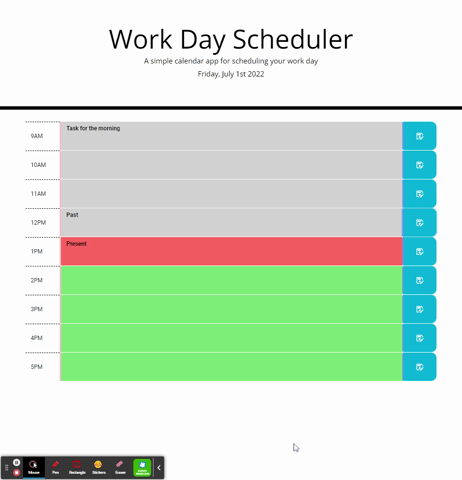

# Work Day Scheduler

## Description
This is a simple calendar application that allows a user to save important events for each hour of the day.  I modified existing starter code to create the functionality.  This app features dynamically updated HTML and CSS powered by jQuery.

  * GitHub repository: https://github.com/espinbrandon49/daily-task-planner

  * Deployed Link: https://espinbrandon49.github.io/daily-task-planner/

## Installation
  * Runs in the browser
  * Git clone - git@github.com:espinbrandon49/daily-task-planner.git

## Tools
### jQuery, Bootstrap, Moment.js, HTML, CSS, Git, GitHub, Chrome DevTools

#### jQuery, Moment.js
* I used the 3rd power API as that was the current code given to me to modify to create the app functionality.
* I used the Moment.js library to work with date and time.
* I also used the web API to persist the tasks in local storage.

#### Bootstrap
* I applied the bootstrap grid system to responsively style the application.
* The starter code used bootstrap and I modified/contributed to integrate my additions, the timeblocks, to work effectively with the provided well-designed structure.

#### HTML
* HTML was provided and I contributed the timeblocks that are effective, cohesive and consistent with the given starter structure and styles.
* The HTML elements are laid out in a logical hierarchial structure 

#### CSS
* CSS was provided and I linked the given style with my added HTML and jQuery.  I modified the style properties if needed without changing the overall theme.
* The application has a responsive layout that adapts to your viewport on various screen sizes.  I also contributed a media query for smaller smart phone screens.

#### Git/GitHub
* The Application is deployed at a live URL and loads with no errors.
* Repository follows best practices for file structure and naming conventions.
* Repository commit messages allow one to follow along as the application development story unfolds.
* Repository contains quality readme with description, screenshot, link to deployed application.
* GitHub repository contains application code.

#### Chrome DevTools
* Used console to diagnose problems with my code.
* Used console to view the results of all of my functions to see that they were doing what I expected and holistically.
* Using DevTools, I viewed my media queries and application on different device screens and to inspect various elements in the Elements panel.
* Used DevTools to examine my box sizes, padding, borders, content, etc., and to view element styles in the browser.

## Collaboration
Jerome Chenette

## Screenshots
####  

